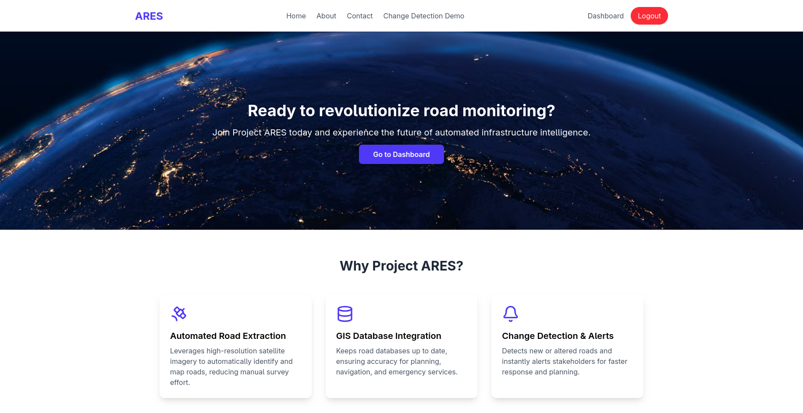
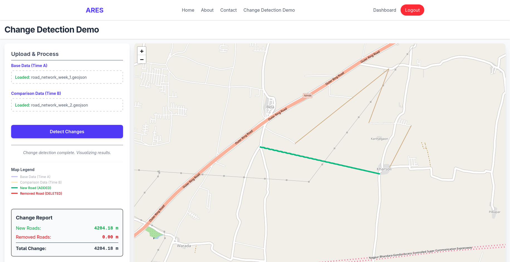
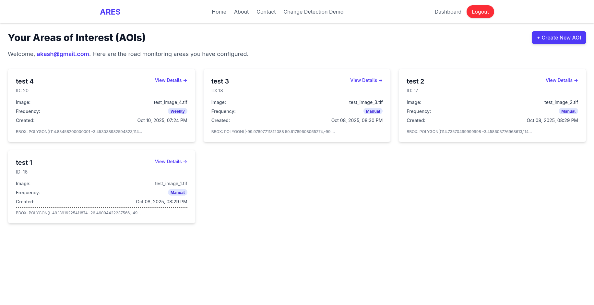
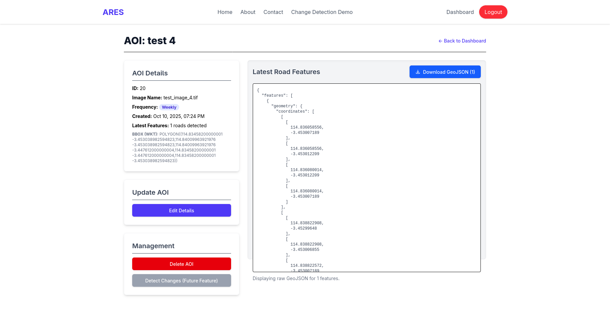

# Project ARES: Automated Road Network Change Detection System

## 🚀 Overview

**Project ARES** (Automated Road Extraction System) is a Final Year Project designed to **automate the monitoring and updating of road network infrastructure** using satellite imagery and geospatial analysis.

It is a full-stack application built with a **React (Vite) frontend**, a **Python (Flask) backend**, and a **PostgreSQL/PostGIS** database, integrating a deep learning model for road segmentation.

### Key Features

- **Automated Road Segmentation:** Utilizes a custom DeepLabV3+ model (stored in `backend/model/`) to extract road features (MultiLineString GeoJSON) from high-resolution TIFF satellite images.
- **Geospatial Change Detection:** Implements PostGIS topological operations to efficiently calculate **Additions (New Roads)** and **Deletions (Removed Roads)** between two temporal snapshots.
- **Area of Interest (AOI) Management:** Allows users to define, track, and schedule automated road change monitoring for specific geographic regions.
- **Full-Stack MVP:** Includes user authentication, database persistence, and a map-based UI for visualization.

---

## 📸 Project Screenshots

|            Home Page View            |                 Change Detection Result                 |                 Dashboard                 |              AOI Details              |
| :----------------------------------: | :-----------------------------------------------------: | :---------------------------------------: | :-----------------------------------: |
|  |  |  |  |

---

## ⚙️ Setup and Installation

### 1\. Repository & Branch Setup

You must clone the specific branch containing the Minimal Viable Product (MVP) code.

```bash
# Clone the repository
git clone --branch mvp --single-branch https://github.com/akash2003git/project-ares.git

# Change directory into the repository
cd project-ares

# Switch to the MVP branch
git checkout mvp
```

### 2\. Model & Data Setup

The ML model handles road segmentation. You need to manually download the trained weights and place them in the correct directory.

1.  **Download Model Weights:**
    - **Hugging Face Space (Model Download):** [https://huggingface.co/spaces/aka2003/road-segmentation-deeplabv3/tree/main](https://huggingface.co/spaces/aka2003/road-segmentation-deeplabv3/tree/main)
    - Download the file named **`best_model_state.pth`** and place it in the **`backend/model/`** directory.

2.  **Kaggle Notebook (Training Reference):** [https://www.kaggle.com/code/akashpravintayade/road-extraction-final](https://www.kaggle.com/code/akashpravintayade/road-extraction-final)

3.  **Create Test Images:**
    - The backend requires TIFF satellite images for initial AOI processing.
    - Please download at least four unique satellite TIFF images (e.g., from OpenAerialMap) and ensure they are in the **`backend/`** root directory with these names:
      - `test_image_1.tif`
      - `test_image_2.tif`
      - `test_image_3.tif`
      - `test_image_4.tif`

### 3\. Database Setup (PostgreSQL with PostGIS)

This project requires **PostgreSQL** with the **PostGIS** extension enabled for geospatial feature storage and change detection algorithms.

1.  **Install and Configure PostGIS:**
    - Log into your PostgreSQL shell (`psql`) and run these commands to set up the database using the credentials found in `backend/config.py`:

    <!-- end list -->

    ```sql
    -- 1. Create the database
    CREATE DATABASE ares_mvp;

    -- 2. Connect to the new database
    \c ares_mvp;

    -- 3. Enable the PostGIS extension (Crucial!)
    CREATE EXTENSION postgis;
    ```

2.  **Create Schema Tables:**
    - The schema definitions are in `backend/utils/db_setup.py`. Run the script to initialize the tables (`users`, `aois`, `road_snapshots`, `road_features`).

    <!-- end list -->

    ```bash
    # From the project root directory
    python backend/utils/db_setup.py
    ```

### 4\. Backend Environment (`backend/`)

1.  **Environment Setup (CPU or CUDA):**
    - Due to the complex geospatial dependencies (**GDAL/Rasterio/Fiona**) and the machine learning framework (**PyTorch/TensorFlow**), a dedicated environment is essential.

    <!-- end list -->

    ```bash
    # 1. Change to the backend directory
    cd backend

    # 2. Create and activate virtual environment
    python3 -m venv venv
    source venv/bin/activate # On Windows: .\venv\Scripts\activate

    # 3. Install dependencies
    # NOTE: If you have a CUDA-enabled GPU, you may need to install PyTorch/TensorFlow separately
    #       before or after this step to ensure GPU support.
    pip install -r requirements.txt
    ```

2.  **Run the Backend API:**

    ```bash
    # Ensure you are still in the backend directory
    export FLASK_APP=app.py
    flask run

    # The API will run at http://127.0.0.1:5000/
    ```

### 5\. Frontend Environment

1.  **Install Dependencies:**

    ```bash
    cd ..
    cd frontend
    npm install
    ```

2.  **Run the Frontend:**

    ```bash
    npm run dev

    # The application will run at http://localhost:5173/ (or similar)
    ```

---

## 💻 Key Backend Components

The core logic of the system is encapsulated in these files within the `backend/` directory:

| File                              | Description                                                                                                             |
| :-------------------------------- | :---------------------------------------------------------------------------------------------------------------------- |
| **`app.py`**                      | Main Flask application, handles request lifecycle, authentication routes, and orchestrates calls to geospatial scripts. |
| **`config.py`**                   | Defines static configuration variables, notably the PostgreSQL connection details and Flask `SECRET_KEY`.               |
| **`scripts/model_processor.py`**  | Contains the ML model loading and inference logic (road segmentation) and outputs the initial road GeoJSON.             |
| **`scripts/ingest_data.py`**      | Handles reading the GeoJSON output and efficiently inserting road features into the PostGIS tables.                     |
| **`scripts/change_detection.py`** | Implements the core geospatial change detection logic using PostGIS queries and geometric operations.                   |
| **`utils/db_setup.py`**           | Contains the SQL schema used to set up the database tables.                                                             |
